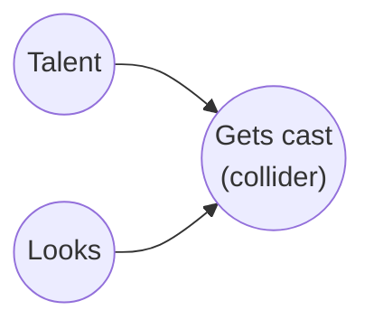

"Add more controls" is usually treated as free advice: if you're not sure a variable belongs in the regression, throw it in and let the coefficient sort itself out. Most of the time that's harmless. Sometimes it's exactly backwards — adding the "right" variable can manufacture a relationship between two things that don't actually affect each other at all.

The culprit is a **collider**: a variable that is a common _effect_ of two causes, rather than a common cause of two effects.

Talent and looks are drawn here as unrelated — nothing in the diagram points from one to the other. But both point into "gets cast." That arrow structure is enough, on its own, to create a correlation between talent and looks the moment you restrict your view to people who got cast.

## Why conditioning on a collider does this

A confounder is a fork: it causes both of your variables, so it opens a path between them, and you close that path by controlling for it. A collider is the opposite shape — a common effect sits at the end of two separate paths, and that structure keeps the paths closed **until you condition on the collider**, at which point you open one back up.

The intuition is "explaining away." Suppose getting cast just requires clearing a bar on talent-plus-looks — either quality can carry you. Once you already know someone got cast, learning that they're not especially talented is informative: it means their looks must have been doing the work. Being told the outcome and one cause changes what you believe about the other cause, even though the two causes never talked to each other. Restrict a sample to people above that bar, and you'll see it as a negative correlation between the two traits — an association that says nothing about either one causing the other, and that vanishes the moment you stop conditioning on who cleared the bar.

This is what epidemiologists call **Berkson's paradox**: two diseases with no biological relationship can look negatively correlated in hospital records, purely because people get admitted when *either* one is severe enough. It's also why "successful founders" tend to look like skill and luck trade off, why journals full of published papers can make rigor and novelty look inversely related, and why, among people who date very attractive partners, personality tends to look worse the better the looks — not because attractive people date jerks, but because plenty of unattractive-but-lovely people never clear the bar to be in the sample at all.

## Try it

Below, two traits are simulated as statistically independent — genuinely, by construction, with a fresh normal random draw each time you click "new sample." The only thing the slider changes is how selective the cutoff for "making it" is. Watch the correlation in the full population stay near zero no matter what, while the correlation among the selected group drifts away from zero — and gets more extreme the more selective the cutoff.

<iframe
  src="{{ '/assets/html/collider-bias-demo.html' | relative_url }}"
  style="width: 100%; height: 640px; border: none;"
  title="Collider bias, live"
  loading="lazy"
  onload="this.style.height = (this.contentWindow.document.documentElement.scrollHeight + 20) + 'px'"
></iframe>

The direction is not an accident of this particular simulation. Whenever a cutoff is a mix of two independent ingredients, being told someone cleared the cutoff *and* was weak on one ingredient tells you they must have been strong on the other. That's the whole mechanism — no measurement error, no confounding, no real effect of one trait on the other anywhere in sight.

## Where this bites in practice

The dangerous version isn't a toy example — it's a variable that looks like an obviously good control because it's measured *after* treatment and *before* the outcome, so it looks like it belongs on the causal path. Classic cases:

- **Selecting on a post-treatment variable.** Studying the effect of a drug on mortality, but only among patients who were discharged alive, conditions on a collider (discharge status is caused by both the drug and by underlying health) and can flip the estimated effect's sign.
- **Controlling for a mediator's sibling.** If treatment affects two downstream outcomes that also affect each other only through a shared cause you haven't measured, conditioning on one to study the other can induce bias where none existed in the treatment effect itself.
- **Survey and sample-selection effects.** Studying what predicts civic participation using only survey respondents conditions on "responded to the survey" — a variable plausibly caused by both the predictor and the outcome you're studying.

The general rule from the causal-graph literature (Pearl; Elwert & Winship 2014, "Endogenous Selection Bias") is that you should not condition on a descendant of two variables whose relationship you care about, unless you also control for whatever induced the bias — and sometimes not even then. "It's measured, so control for it" is not a safe default; the graph, not the availability of the variable, has to decide what belongs in the model.

## Takeaway

More controls are not automatically more correct. Before adding a variable to a model — or restricting a sample on it — ask what causes it. If it's downstream of both the variable and the outcome you're relating, you may be looking at a collider, and conditioning on it can manufacture the very relationship you're trying to measure.
