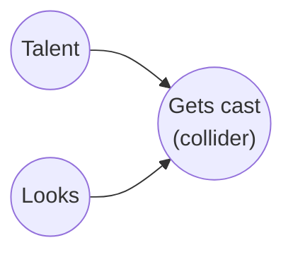

---

layout: post
title: Collider bias, or why "controlling for more" can make things worse
date: 2026-09-28
description: Conditioning on a variable that two other things both cause can create a correlation between them that wasn't there before. A live demo you can push around.
tags: statistics causal-inference
categories:
mermaid:
enabled: true
zoomable: false
---------------

"Add more controls" is pretty common advice when you're running a regression. If you're unsure whether a variable belongs in the model, why not just throw it in? The coefficient can sort itself out.

The problem is that sometimes the extra control is exactly what causes the problem.

A **collider** is a variable that is caused by two other variables. If you're interested in the relationship between those two causes, conditioning on the collider can create a relationship between them even when none existed to begin with.

Here, talent and looks are unrelated. There's no arrow between them, and in this example they really are independent. But they both affect whether someone gets cast.

Now suppose we look only at people who got cast. Suddenly, talent and looks will tend to be negatively correlated.

Why?

## Why conditioning on a collider does this

It's easiest to see with a simple example. Imagine that getting cast depends on some combination of talent and looks. You don't need to be especially talented if you look great, and you don't need to be especially good-looking if you're extremely talented. You just need enough of the two combined to clear some threshold.

Now imagine that you meet someone who got cast and discover that they're not particularly talented. What would you infer about their looks?

Probably that they must be pretty good-looking. Otherwise, how did they get past the casting threshold?

The reverse works too. If you know someone got cast but isn't particularly good-looking, you'd expect them to be especially talented.

That's the key idea. Once we condition on getting cast, information about one of the causes tells us something about the other cause. The two variables become negatively correlated even though they were completely unrelated in the population we started with.

This is sometimes called **Berkson's paradox**. The classic example is hospital data: two diseases can be unrelated in the general population but negatively correlated among hospital patients if having either disease makes someone more likely to end up in the hospital.

The same logic can show up in less obvious places. Among successful founders, for example, skill and luck might appear to trade off. In a sample of published papers, rigor and novelty might appear negatively related. And among people who date very attractive partners, you might find a relationship between attractiveness and personality that isn't present in the population as a whole.

None of these patterns necessarily tells us that the two underlying traits actually cause each other. They can arise simply because we're looking at a selected group.

## Try it

The simulation below makes the point pretty directly.

Talent and looks are generated independently, so by construction there is no relationship between them. Every time you click "new sample," you get a fresh random draw.

The slider controls how selective the casting process is. Move it around and compare the correlation in the full population with the correlation among people who got cast.

The population correlation stays around zero. The correlation in the selected sample doesn't.

And as the casting threshold gets more selective, the induced correlation becomes stronger.

<iframe
  src="{{ '/assets/html/collider-bias-demo.html' | relative_url }}"
  style="width: 100%; height: 640px; border: none;"
  title="Collider bias, live"
  loading="lazy"
  onload="this.style.height = (this.contentWindow.document.documentElement.scrollHeight + 20) + 'px'"
></iframe>

There's nothing special about the particular simulation. The same thing happens whenever selection depends on two otherwise independent variables.

If you know someone made it through the selection process and you also know they were weak on one of the ingredients, that tells you something about how strong they must have been on the other ingredient.

You didn't discover a real relationship between the two variables. You created one by conditioning on selection.

## Where this bites in practice

The more important cases aren't toy examples like casting actors. They show up when a variable looks like a perfectly reasonable thing to control for.

One common mistake is **conditioning on a post-treatment variable**. Suppose you want to estimate the effect of a drug on mortality, but you restrict the analysis to patients who were discharged from the hospital. Discharge status may depend both on the treatment and on a patient's underlying health. Conditioning on discharge can therefore introduce a relationship that wasn't there in the population you started with, potentially even changing the apparent direction of the treatment effect.

Another possibility is **conditioning on one variable that is downstream of treatment when you're interested in another downstream outcome**. If treatment affects multiple things, controlling for one of them can change the comparison you're making in ways that aren't obvious from the regression table.

There's also **sample selection**. Suppose you're studying what predicts civic participation using survey data. If the decision to respond to the survey depends both on your predictor and on civic participation, then looking only at respondents means you're conditioning on a variable that is itself caused by both sides of the relationship you're trying to study.

These examples are different, but the underlying question is the same:

**What causes the variable I'm conditioning on?**

That's why "it's measured, so control for it" isn't a particularly good rule for causal analysis. Whether a variable belongs in the model depends on the causal structure, not just on whether you happen to have data on it.

## Takeaway

Adding controls isn't automatically a way to make a model better.

Before adding a variable to a regression — or restricting your sample based on it — think about what causes that variable. If it's a common effect of the variables whose relationship you're trying to estimate, conditioning on it can create a relationship that wasn't there in the first place.

Sometimes the problem with a regression isn't that you didn't control for enough.

It's that you controlled for the wrong thing.
